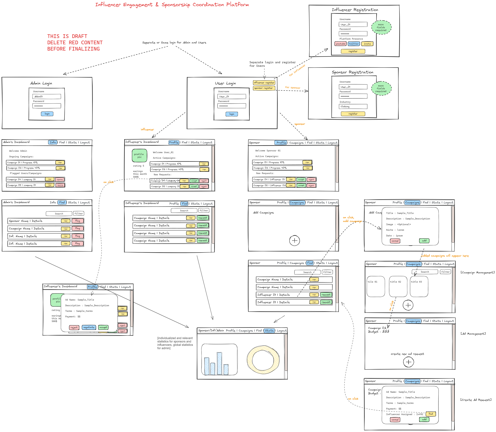

# PromoSync

Welcome to the repository for my MAD 1 (Mobile Application Development 1) project at IITM! This repository contains all the resources, code, and tutorials that I have used and developed throughout the course. It serves as a comprehensive collection of materials that can help others understand and build upon the project.


## Repository Structure

- **Code**: Contains all the source code files for the project, including implementation for various features and functionalities.
- **Resources**: Includes all external resources like images, icons, and libraries used in the project.
- **Tutorials**: Step-by-step tutorials and guides that explain different aspects of the project and how to use the provided code and resources.
- **Docs**: Documentation related to the project, including API references, design documents, and other relevant information.

# Modern Application Development I

## Project Statement

### Influencer Engagement and Sponsorship Coordination Platform

This project aims to develop a platform that connects Sponsors and Influencers. Sponsors can advertise their products/services, and Influencers can benefit monetarily.

---

## Frameworks to be Used

The following frameworks are mandatory for this project:

- **Flask** for application code
- **Jinja2** templates + **Bootstrap** for HTML generation and styling
- **SQLite** for data storage

*Note: All demos should be possible on your local machine.*

---

## Roles

The platform will have three roles:

1. **Admin** - root access
   - Monitor all users/campaigns, see all statistics.
   - Ability to flag inappropriate campaigns/users.

2. **Sponsors** - a company/individual who wants to advertise their product/service
   - Create campaigns, search for influencers, and send ad requests.
   - Track multiple campaigns.
   - Accept ad requests from influencers for public campaigns.

   Attributes:
   - Company Name / Individual Name
   - Industry
   - Budget

3. **Influencers** - individuals with significant social media following
   - Receive, accept, or reject ad requests.
   - Negotiate terms and resend modified ad requests.
   - Search for and accept public campaigns.

   Attributes:
   - Name
   - Category
   - Niche
   - Reach (number of followers/activity)

---

## Terminologies

- **Ad request**: A contract between a campaign and an influencer, outlining advertisement requirements and payment.

  Attributes:
  - campaign_id (Foreign Key to Campaign table)
  - influencer_id (Foreign Key to Influencer/user table)
  - messages
  - requirements
  - payment_amount
  - status (Pending, Accepted, Rejected)

- **Campaign**: A container for ad requests with a specific goal (e.g., advertisement for Samsung s23).

  Attributes:
  - name
  - description
  - start_date
  - end_date
  - budget
  - visibility (public, private)
  - goals

---

## Application Wireframe



*Note: The wireframe is provided to understand the application flow. It is NOT mandatory to replicate the exact views. You can design your own frontend.*

---

## Core Functionalities

1. **Admin and User Login**
   - A login/register form for sponsors, influencers, and admins.
   - Differentiate user types in the model.

2. **Admin Dashboard**
   - Display application statistics (e.g., active users, campaigns, ad requests, flagged sponsors/influencers).

3. **Campaign Management (Sponsors)**
   - Create, update, and delete campaigns.
   - Categorize campaigns into niches.

4. **Ad Request Management (Sponsors)**
   - Create, edit, and delete ad requests based on campaign goals.

5. **Search Functionality**
   - Sponsors: Search for influencers based on niche, reach, followers.
   - Influencers: Search for public campaigns based on niche, relevance.

6. **Ad Request Actions (Influencers)**
   - View, accept/reject ad requests.
   - Negotiate payment amounts.

---

## Recommended Functionalities

- Create API resources for interacting with users, ad requests, and/or campaigns.
- Use external libraries for charts (e.g., ChartJS).
- Implement frontend and backend validation on forms.

---

## Optional Functionalities

- Enhance application styling using CSS or Bootstrap.
- Implement a secure login system using Flask extensions.
- Create a dummy payment portal.
- Add any additional features you find appropriate.

---

## Evaluation

- Submit a project report (max 2 pages) along with the project.
- Include student details, project details, frameworks/libraries used, ER diagram, API endpoints, and a video link.
- Submit all code in a single zip file.
- Create a 3-5 minute presentation video explaining the project.
- Give a live demo and answer questions during the viva.

---

## Instructions

- This document is subject to updates. 
- The problem statement will be finalized by May 19, 2024. 
- Submit the project as a single zip file.

---

## Useful Resources

- **Flask Documentation**: [Flask](https://flask.palletsprojects.com/)
- **Jinja2 Documentation**: [Jinja2](https://jinja.palletsprojects.com/)
- **Bootstrap Documentation**: [Bootstrap](https://getbootstrap.com/)
- **SQLite Documentation**: [SQLite](https://sqlite.org/docs.html)
- **ChartJS Documentation**: [ChartJS](https://www.chartjs.org/)
- **Flask-Login**: [Flask-Login](https://flask-login.readthedocs.io/)
- **Flask-Security**: [Flask-Security](https://flask-security.readthedocs.io/)

---

## Getting Started

To get started with this project, follow the instructions below:

1. **Clone the repository**:
    ```bash
    git clone https://github.com/yourusername/mad1-iitm-project.git
    cd mad1-iitm-project
    ```

2. **Install dependencies**:
    ```bash
    npm install
    ```

3. **Run the application**:
    ```bash
    npm start
    ```

## Resources and References

- [Course Material](#): Link to course material and lectures.
- [External Libraries](#): List of external libraries and tools used in the project.
- [Useful Tutorials](#): Links to tutorials and guides that were helpful during the development.

## Contribution

If you would like to contribute to this project, please follow these steps:

1. Fork the repository.
2. Create a new branch (`git checkout -b feature-branch`).
3. Make your changes and commit them (`git commit -m 'Add some feature'`).
4. Push to the branch (`git push origin feature-branch`).
5. Open a pull request.

## License

This project is licensed under the MIT License - see the [LICENSE](LICENSE) file for details.

## Acknowledgements

I would like to thank [list any people, resources, or tools that were particularly helpful].

---

